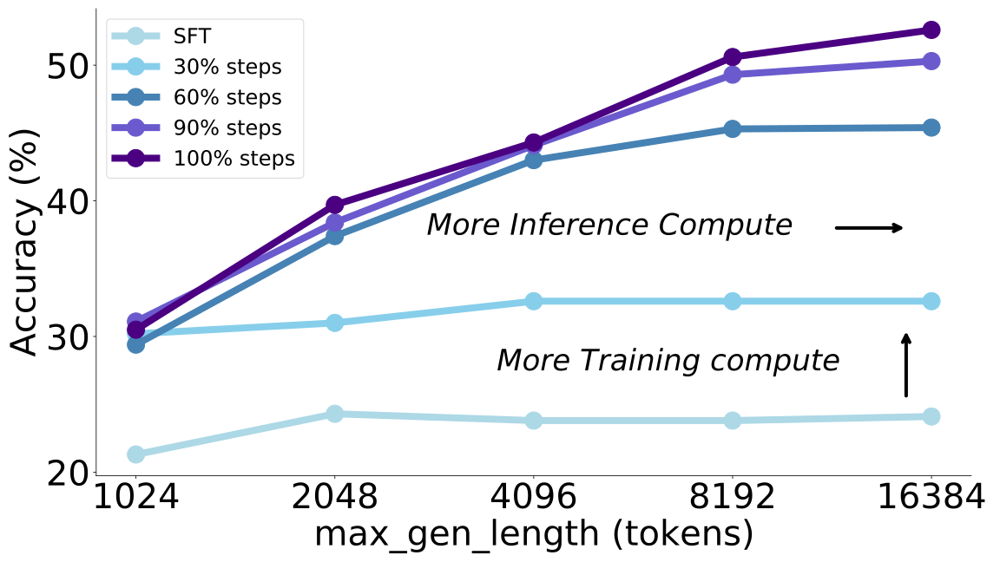

****<div align="center">

<h1>Advancing Language Model Reasoning through Reinforcement Learning and Inference Scaling</h1>

<p align="center">
  <a href="https://arxiv.org/abs/2501.11651">📃Paper</a> •
  <a href="https://huggingface.co/datasets/THUDM/T1">🤗Datasets</a> •
  <a href="">🤗Model (coming soon)</a>
</p>

</div>


## Introduction

We present T1 with strong reasoning ability and superior performance on challenging mathematical reasoning benchmarks.
T1 is trained by scaling RL by encouraging exploration and understand inference scaling. We first initialize the LLM using synthesized chain-of-thought data that integrates trial-and-error and self-verification.  T1 with open LLMs as its base exhibits inference scaling behavior and achieves superior performance on challenging math reasoning benchmarks. 

- **[2025/01/22]** We have released the [paper](https://arxiv.org/abs/2501.11651) and [SFT data](https://huggingface.co/datasets/THUDM/T1). Model weights and RL training data will be released soon.

<p align="center">

</p>

<p align="center">
Figure 1: Training scaling and inference scaling of T1 on the AIME2024 dataset
</p>


## Results

Our approach achieves competitive performance across challenging mathematical reasoning benchmarks:


| Model | MATH500 | AIME | Omni-MATH-500 | GPQA |
|-------|---------|------|---------------|------|
| GPT-4o | 76.6 | 9.3 | 26.8 | 53.6 |
| Claude-3.5-sonnet | 78.3 | 16.0 | - | 65.0 |
| Llama-3.3-70B-Instruct | 73.9 | 24.2 | 27.9 | 50.5 |
| Qwen2.5-Math-7B-Instruct | 82.7 | 16.7 | 29.7 | 36.9 |
| o1-preview | 85.5 | 44.6 | - | 72.3 |
| QwQ-32B-preview | 90.6 | 50.0 | 46.6 | 58.2 |
| | | | | |
| T1-SFT (GLM-4-9B) | 60.2 | 4.1 | 20.0 | 37.2 |
| T1 (GLM-4-9B) | 65.8 | 9.2 | 24.4 | 38.1 |
| T1-SFT (Qwen2.5-14B) | 77.2 | 10.3 | 28.5 | 42.3 |
| T1 (Qwen2.5-14B) | 87.4 | 30.5 | 38.6 | 48.3 |
| T1-SFT (Qwen2.5-32B) | 83.4 | 24.9 | 34.6 | 49.5 |
| T1 (Qwen2.5-32B) | 92.4 | 50.6 | 49.6 | 56.1 |

## 📚 Citation

```
Coming soon!
```
